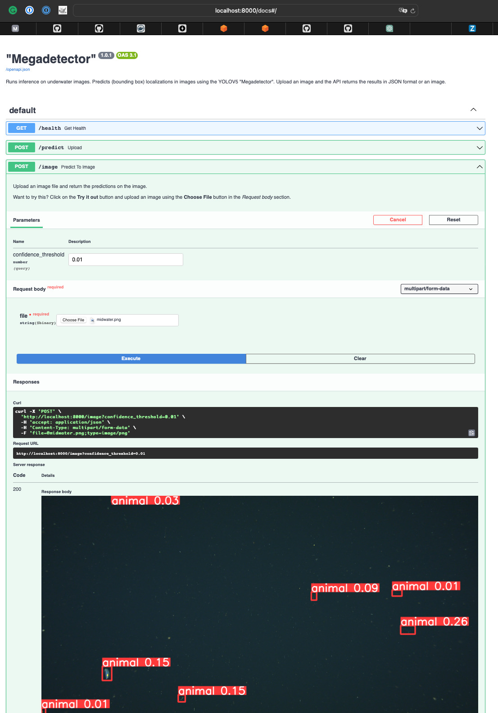
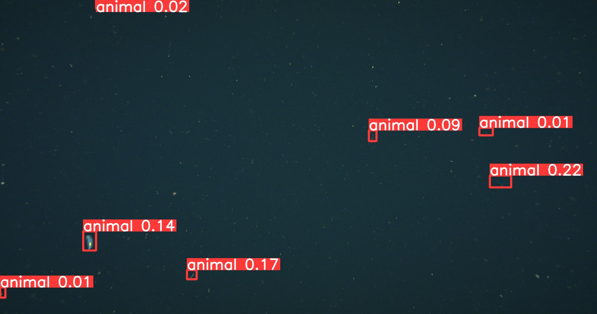

[](http://www.mbari.org)
[](https://github.com/semantic-release/semantic-release)

[](https://www.python.org/downloads/)

**fastapi-yolov5** code deploys and runs the YOLOv5 model in the Python web framework [FastAPI](https://fastapi.tiangolo.com/) either locally or in AWS.
In AWS, the model is deployed with ECS Fargate and exposed with an Application Load Balancer.
  



# Requirements

- [Docker](https://docs.docker.com/get-docker/)
- [Docker Compose](https://docs.docker.com/compose/install/)
- [AWS CLI](https://docs.aws.amazon.com/cli/latest/userguide/cli-chap-install.html)

# Deploy YOLOv5 locally

## Clone the repository
```shell
git clone http://github.com/mbari-org/fastapi-yolov5
cd fastapi-yolov5
```

## Download an example model

```shell
cd src/app/model
aws s3 cp --no-sign-request s3://902005-public/models/Megadetector/best.pt .
aws s3 cp --no-sign-request s3://902005-public/models/Megadetector/labels.txt .
```

## Start the FastAPI server

```shell
docker-compose up
```
To stop the server, run
```shell
docker-compose down
```

# Running

## Health Check
Check the health of the server by going to `http://localhost:8000/health`.  You should see the following response:

```json
{"status":"ok"}
```

## Predict to JSON

Send a POST request to `http://localhost:8000/predict` with an image file in the body to get a prediction returned in JSON format.
By default, predictions greater than 0.01 are posted.

```shell
curl -X POST "http://localhost:8000/predict" -H "accept: application/json" -H "Content-Type: multipart/form-data" -F "file=@tests/midwater.png"
```

# Predict to an image file

Send a POST request to `http://localhost:8000/image` with an image file in the body to get the predictions displayed on an image.
By default, predictions greater than 0.01 are displayed.

```shell
curl -X POST "http://localhost:8000/image" -H "accept: application/json" -H "Content-Type: multipart/form-data" -F "file=@tests/midwater.png" -o midwater_detect.png
```


 


# Deploy YOLOv5 in AWS

FastAPI deployed with ECS Fargate and exposed with an Application Load Balancer

```shell
cdk bootstrap
cdk deploy
```

You should see at the end the exposed endpoint, e.g. **http://FastA-FastA-53HYPWCIRUXS-1905789853.us-west-2.elb.amazonaws.com** below.


```shell
FastAPIStack: deploying... [1/1]
FastAPIStack: creating CloudFormation changeset...

 ✅  FastAPIStack

✨  Deployment time: 369.74s

Outputs:
FastAPIStack.FastAPIYOLOv5ServiceLoadBalancerDNS68FA283F = FastA-FastA-53HYPWCIRUXS-1905789853.us-west-2.elb.amazonaws.com
FastAPIStack.FastAPIYOLOv5ServiceServiceURL365F19C7 = http://FastA-FastA-53HYPWCIRUXS-1905789853.us-west-2.elb.amazonaws.com
Stack ARN:
arn:aws:cloudformation:us-west-2:975513124282:stack/FastAPIStack/89fcc790-07d4-11ee-924e-02e23803e407

✨  Total time: 377.69s
```

Test this by running a test image through the endpoint

```
curl -X POST "http://FastA-FastA-53HYPWCIRUXS-1905789853.us-west-2.elb.amazonaws.com/predict" -H "accept: application/json" -H "Content-Type: multipart/form-data" -F "file=tests/midwater.png"
```

## Deploying a custom model locally

To override the default model, you can mount a local directory to the container and set the MODEL_PATH environment variable.

For example, if you have a model in the directory `./models/midwater102`, you can mount that directory to the container by adding 
the following to the `docker-compose.yml` file.

```yaml
app:
    volumes:
      - ./models/midwater102:/src/app/model
    environment:
      - MODEL_WEIGHTS=/src/app/model/best.pt
      - MODEL_LABELS=/src/app/model/labels.txt
      - MODEL_DESCRIPTION=Megadetector
```
 
The labels file should be in the format of one label per line.

```
.
├── models/             # Parent directory for models
│   │
│   ├── midwater102/    # Model directory
│   │   ├── best.pt     #  Model YOLOv5 checkpoint file
│   │   ├── labels.txt  #  Model YOLOv5 labels file

```

```shell
docker-compose up
```

## Deploying a custom model in AWS from node

Specify any custom configuration on scaling in `config.yaml` file for the stack resources, e.g. min and max capacity.

```yaml
MinCapacity: 1
MaxCapacity: 5
```

To override the default model, upload yor model, e.g. `best.pt` file and the labels file `labels.txt` for that model to an S3 bucket.
The S3 bucket must be in the same region as the ECS cluster. Define the S3 bucket and the model path in the `config.yml` file.
These can be overridden as needed in the AWS console through the ECS task definition as environment variables.

```yaml
MODEL_WEIGHTS: s3://901103-models-deploy/midwatervars102/best.pt
MODEL_LABELS: s3://901103-models-deploy/midwatervars102/labels.txt
MODEL_DESCRIPTION: Megadetector
MODEL_INPUT_SIZE: 1280
```

Deploy the stack with the new configuration

```shell
cdk deploy
```

## Deploying a custom model in AWS from docker

Assuming model is trained with deepsea-ai package. Can deploy with script below

Set your AWS keys
```
export AWS_ACCESS_KEY_ID=
export AWS_SECRET_ACCESS_KEY=
```

```bash
#!/bin/bash
set -x
# Keep stack output persistent so the cloud formation state doesn't get into a weird state
mkdir -p stacks/y5x6fastapi

# Create the config file for autoscaling
cat << 'EOF' > y5x6fastapi.yaml
Environment: Production
Author: DCline
Region: us-west-2
MinCapacity: 0
MaxCapacity: 1
Account: 975513124282
ProjectName: FastAPI-YOLOv5
ProjectNumber: 901103
Description: This stack deploys a Fargate managed ELB environment for creating localized detections from a YOLOv5 model using the FastAPI framework with a Ctenophora sp. A model
MODEL_WEIGHTS: s3://902005-public/models/Megadetector/best.pt
MODEL_LABELS: s3://902005-public/models/Megadetector/labels.txt
MODEL_DESCRIPTION: y5x6ctenospA
MODEL_INPUT_SIZE: 1280
EOF

# Run in AWS with
docker run -it --rm -e AWS_ACCESS_KEY_ID=${AWS_ACCESS_KEY_ID} \
            -e AWS_SECRET_ACCESS_KEY=${AWS_SECRET_ACCESS_KEY} \
            -e AWS_REGION=us-west-2 \
            -e MODEL_WEIGHTS=s3://901103-models-deploy/y5x6ctenospA/best.pt \
            -e MODEL_LABELS=s3://901103-models-deploy/y5x6ctenospA/labels.txt \
            -e MODEL_INPUT_SIZE=1280 \
            -e MODEL_DESCRIPTION=y5x6ctenospA \
	    -v $PWD/y5x6fastapi.yaml:/app/config.yaml \
	    -v $PWD/stacks/y5x6fastapi:/logs \
	    --name y5x6ctenospAflb \
	    mbari/fastapi-yolov5-fargate-elb /app/config.yaml /logs
```
